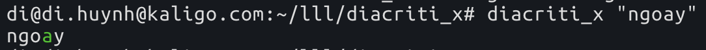

# DiacritiX

A simple gem to specify which letter in a Vietnamese word should accents be place above

# Installation

```bash
gem install diacriti_x
```

# Usage

```bash
diacriti_x "ngoay"
```



# Inspirations

- http://just.nicepeople.free.fr/Vietnamese-Typing.htm#PlaceOfAccent
